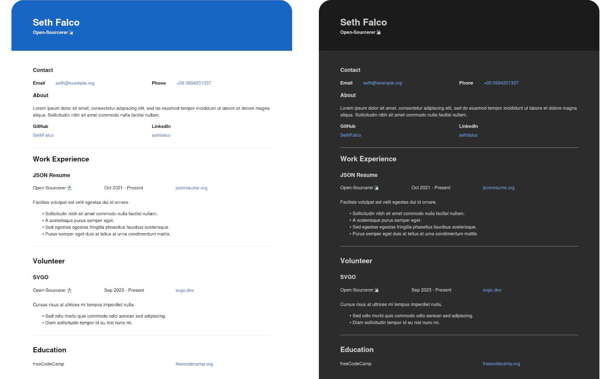

# Class Theme for JSON Resume

A modern theme for [JSON Resume](http://jsonresume.org/) which is self-contained. The content of the resume will work offline and can be hosted without depending on
or making requested to third-party servers.

## Features

### JSON Resume 1.0.0

This supports the JSON Resume 1.0.0 spec, and is backward compatible with earlier versions.

### Markdown

You can use inline Markdown on properties to make text bold, italic, or link them to external pages. This namely applies to the `summary` and `highlights` properties in the JSON Resume schema.

### Open Graph Protocol

Populates the `head` of the HTML document with [Open Graph](https://ogp.me/) tags. This allows social media platforms and instant messengers to create embeds when your resume is shared.

## Preview 

