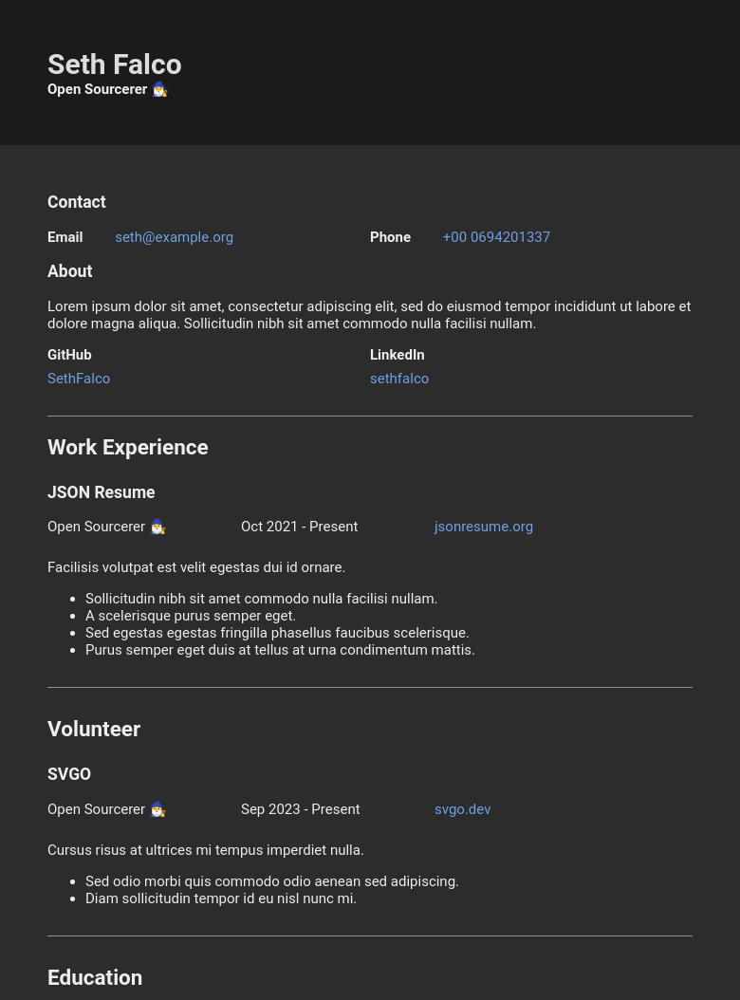

# Class Theme for JSON Resume

[](https://matrix.to/#/#json-resume:one.ems.host)
[](https://www.npmjs.com/package/@jsonresume/jsonresume-theme-class)

A modern theme for [JSON Resume](http://jsonresume.org/) which is self-contained. The content of the résumé will work offline and can be hosted without depending on or making requests to third-party servers.

## Usage

```sh
# Install resume-cli via npm, yarn, pnpm, or whatever package manager you want
npm install --global resume-cli

# Install @jsonresume/jsonresume-theme-class in the directory resume.json is in
npm install @jsonresume/jsonresume-theme-class

# Export as an HTML page, ready to be served by any web server
resume export --theme @jsonresume/jsonresume-theme-class index.html

# Export a PDF document, it's recommended to use your name as the file name
resume export --theme @jsonresume/jsonresume-theme-class your-name.pdf
```

### Accessibility

It's recommended to declare the `meta.language` property in your JSON Resume for accessibility. This is the [BCP47 tag](https://developer.mozilla.org/docs/Web/HTML/Global_attributes/lang#language_tag_syntax) for the language your résumé is written in. For example, `en` for English.

### For Servers

**Heads-up!** ⚠️ This project _doesn't_ sanitize the input/output. Typical usage is to run this locally with your own JSON Resume, so a trustworthy environment with trustworthy input. If this project will be deployed in a server environment, you must use a library like [DOMPurify](https://github.com/cure53/DOMPurify) to sanitize the output.

## Features

### JSON Resume 1.0.0

This supports the JSON Resume 1.0.0 spec and is backward compatible with earlier versions.

### Application Tracking System (ATS) Friendly

Many companies and recruiters use [ATS](https://wikipedia.org/wiki/Applicant_tracking_system) systems that [parse CVs](https://wikipedia.org/wiki/R%C3%A9sum%C3%A9_parsing) and extract the information into a standard format. We review some of these tools and adhere to standard practices while building the theme.

### Markdown

You can use inline Markdown in the following properties to make text bold, italic, or link them to external pages:

- `summary`
- `highlights`

### Open Graph Protocol

Populates the `head` of the HTML document with [Open Graph](https://ogp.me/) tags. This enables social media platforms and instant messengers to create embeds when your résumé is shared.

### Dark Mode

Includes a dark mode, and uses the [`prefers-color-scheme`](https://developer.mozilla.org/docs/Web/CSS/@media/prefers-color-scheme) CSS property to provide a positive user-experience.

### Optimized

This theme makes no external connections, doesn't embed scripts, and is lightweight by design. Both HTML and PDF exports are minimal.

## Preview

 
